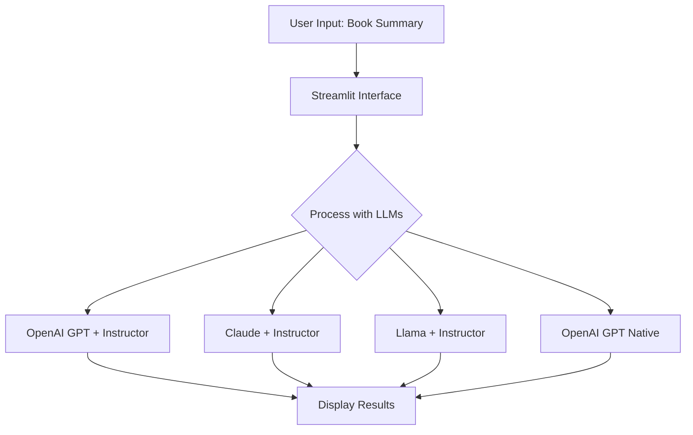

# LLM Structured Outputs Testing

## Description
This project compares the performance of different Language Models (LLMs) in generating structured outputs for book information. It utilizes various LLMs, including GPT, Claude, and Llama, along with different techniques for structured output generation. The project aims to provide insights into the capabilities and differences of these models when tasked with extracting specific information from book summaries.


## How It Works
The application takes a book summary as input and processes it through four different LLM implementations:

1. OpenAI's GPT with Instructor
2. Anthropic's Claude with Instructor
3. Llama (via Groq) with Instructor
4. OpenAI's GPT with native structured outputs

Each implementation attempts to extract structured information about the book, including title, author, genres, publication year, and a brief summary.

You can see a demo of it [here](https://cln.sh/tkLBZrrF).

Here's a diagram of the process:


## Features
- **Multiple LLM Comparison**: Compares outputs from GPT, Claude, and Llama models.
- **Structured Output Generation**: Uses both the Instructor library and OpenAI's native structured outputs.
- **User-Friendly Interface**: Built with Streamlit for easy interaction and result visualization.
- **Detailed Book Information**: Extracts title, author, genres, publication year, and summary from given book descriptions.

## Files
- **main.py**: Contains the Streamlit interface and main application logic.
- **book_analysis.py**: Implements the different LLM approaches for extracting book information.

## Setup
To run this project, you'll need Python installed on your system. Follow these steps:

1. Clone the repository:
   ```
   git clone https://github.com/yourusername/your-repo-name.git
   cd your-repo-name
   ```

2. Install the required packages:
   ```
   pip install streamlit openai anthropic groq instructor pydantic
   ```

3. Set up your API keys as environment variables:
   ```
   export OPENAI_API_KEY='your_openai_api_key'
   export ANTHROPIC_API_KEY='your_anthropic_api_key'
   export GROQ_API_KEY='your_groq_api_key'
   ```

4. Run the Streamlit app:
   ```
   streamlit run main.py
   ```

## Usage
1. Open the Streamlit app in your web browser.
2. Enter a book summary in the text area provided.
3. Click the "Analyze Summary" button.
4. View the structured information extracted by each LLM implementation.

## Key Packages/Tools
- [Streamlit](https://streamlit.io/): For creating the web interface
- [OpenAI](https://openai.com/): For GPT model access
- [Anthropic](https://www.anthropic.com/): For Claude model access
- [Groq](https://groq.com/): For Llama model access
- [Instructor](https://github.com/jxnl/instructor): For structured output generation with LLMs
- [Pydantic](https://pydantic-docs.helpmanual.io/): For data validation and settings management

## Potential Improvements
- Implement a scoring system to evaluate the accuracy of extracted information
- Add functionality to analyze multiple book summaries in batch

## License
This project is open source and available under the [MIT License](LICENSE).

## Acknowledgements
- Thanks to the creators of the Instructor library for simplifying structured output generation with LLMs.
- Appreciation to OpenAI, Anthropic, and Groq for providing access to their powerful language models.
